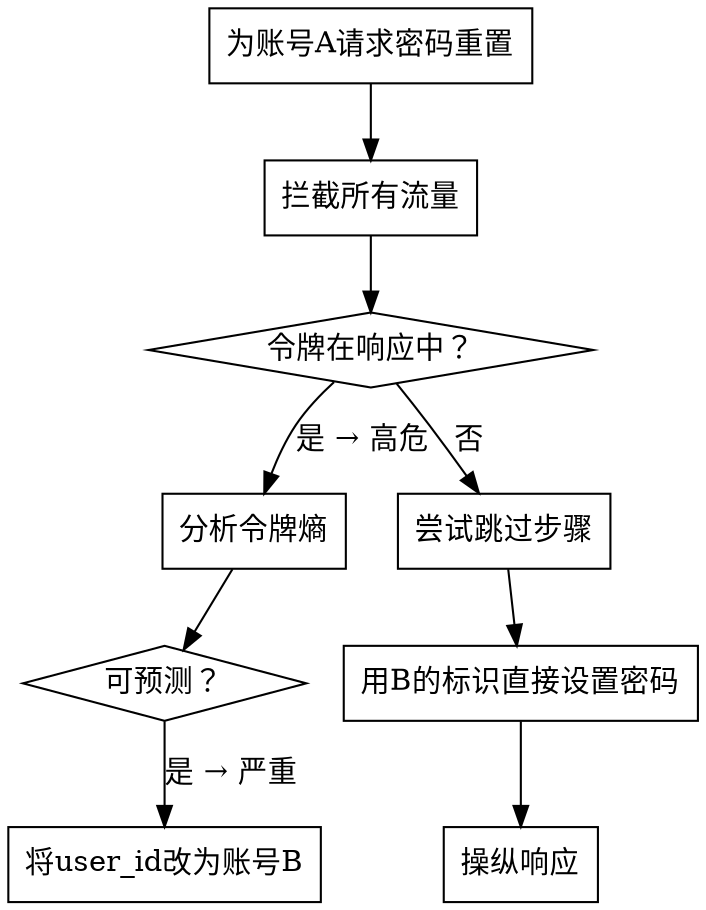

# 身份认证领域

## 概述

身份认证漏洞是突破口。8,846 起 WooYun 案例（占所有发现的 40%）证明：大多数应用在第一道防线就已失守。

**核心原则：** 身份认证是一条链。每一环都必须守住——凭证、会话、重置流程、验证机制。一个薄弱环节 = 完全绕过。

## 按子域划分的攻击模式

### 弱凭证（7,513 个案例，58.2% 高危）

**铁律：在任何其他身份认证测试之前，先测试默认凭证。WooYun 所有案例中 34% 属于弱密码/默认密码。**

**系统化测试清单：**

```
阶段 1：默认凭证
- [ ] admin/admin, admin/123456, admin/admin123
- [ ] root/root, root/toor, root/password
- [ ] test/test, guest/guest, demo/demo
- [ ] [厂商名]/[厂商名]（如 tomcat/tomcat）
- [ ] [产品名]/[产品名]
- [ ] 查阅厂商文档中的默认凭证

阶段 2：社会工程学密码
- [ ] 公司名（小写、首字母大写、加年份）
- [ ] 域名（不含顶级域名、加数字）
- [ ] 产品名 + 常见后缀（123, @123, !@#）
- [ ] 城市名 + 年份（beijing2024）
- [ ] 手机号码模式（中国系统常见）

阶段 3：凭证填充攻击
- [ ] 中国 Top 100 密码（123456, a123456, 123456789）
- [ ] 全球 Top 100 密码
- [ ] 行业特定默认密码（医疗、金融、教育）

阶段 4：绕过反暴力破解
- [ ] 验证码重用（同一会话，不刷新）
- [ ] 验证码移除（从请求中删除参数）
- [ ] IP 轮换（X-Forwarded-For 头操纵）
- [ ] 通过响应差异进行账户枚举
- [ ] 通过分布式请求绕过速率限制
```

**关键参数：** `username`, `password`, `account`, `passwd`, `pwd`, `pass`

### 密码重置（777 个案例，88.0% 高危）

**在整个 WooYun 数据集中严重性级别最高。每个密码重置流程都存在漏洞。**

**攻击模式矩阵：**

| 模式 | 测试方法 | WooYun 普遍性 |
|------|---------|-------------|
| 令牌在 URL/响应中 | 拦截重置响应，检查令牌 | 极高 |
| 可预测令牌 | 请求多次重置，分析令牌熵 | 高 |
| 步骤跳过 | 直接跳到"设置新密码"步骤 | 高 |
| 用户 ID 操纵 | 在重置请求中更改 user_id/email | 极高 |
| 响应操纵 | 在客户端将 `{"success":false}` 改为 `{"success":true}` | 中等 |
| 验证码重用 | 在不同用户间使用相同的短信/邮件验证码 | 中等 |
| Host 头注入 | 在 Host 头中注入攻击者域以获取重置链接 | 中等 |
| 时序攻击 | 通过响应时间差异判断有效账户 | 低 |

**测试流程：**



### 登录绕过（57 个案例，57.9% 高危）

**模式：**
- 登录表单 SQL 注入：`' OR 1=1--`
- 默认后门账户（留在生产环境的调试/测试账户）
- 身份认证逻辑反转（检查 `if NOT authenticated` 而不是 `if authenticated`）
- Cookie/令牌伪造（签名弱，无验证）
- OAuth 错误配置（redirect_uri 操纵、state 参数缺失）

### 验证码/验证绕过（384 个案例，44% 高危）

**系统化验证码绕过：**

| 绕过技术 | 测试方法 |
|---------|---------|
| 无服务器端验证 | 从请求中完全移除验证码参数 |
| 可重用验证码 | 多次提交相同的验证码值 |
| 可预测验证码 | 分析验证码生成算法 |
| 可 OCR 识别的验证码 | 字体简单，无干扰，无旋转 |
| 语音验证码绕过 | 对语音选项进行语音转文本识别 |
| 短信验证码无过期 | 申请新验证码后仍可使用旧验证码 |
| 短信验证码无速率限制 | 暴力破解 4-6 位数字短信验证码 |
| 短信验证码跨用户共享 | 将发给手机 A 的验证码用于账户 B |
| 客户端验证码检查 | 仅在 JavaScript 中验证验证码 |

## 真实案例

| 案例 | 子域 | 影响 |
|------|------|------|
| TCL统一身份认证平台漏洞，所有用户账号密码可重置 | 密码重置 | 跨 N+ 个业务系统的完整账户接管 |
| 蜻蜓FM公众平台任意用户密码重置 | 密码重置 | 任意用户密码重置 |
| M1905电影网某重要站点任意密码重置（已入官方账号） | 密码重置 | 官方账号被攻破 |
| 嘟嘟牛旗下百乐吧密码重置漏洞涉及279个网吧上网用户数据 | 密码重置 | 279 个网吧用户账户泄露 |
| 飞特物流某系统后台登录绕过/SQL注入（千万用户/运单/银行卡/身份证照片） | 登录绕过 | 1000 万+ 用户、银行卡、身份证照片 |
| 搜狐APP某站登录绕过+SQL注入root权限 | 登录绕过 | 数据库根级访问权限 |
| 格兰仕厂商协同平台认证绕过执行/root权限/已Shell | 认证绕过 | 远程代码执行 |
| 华安保险某站认证绕过命令执行可Shell | 认证绕过 | 保险系统远程代码执行 |
| 爱卡汽车网某重要系统设计逻辑缺陷成功绕过验证码限制 | 验证码绕过 | 启用暴力破解 |
| 驴妈妈旅游网从验证码绕过再到任意酒店数据导出 | 验证码绕过 | 酒店数据渗漏 |
| 上海航空员工个人信息泄露/密码重置（绕过短信验证）/内部资料泄露 | 短信绕过 | 员工个人信息 + 内部文档 |

## 防御模式（来自 WooYun 修复数据）

### 代码层面
- 密码：bcrypt(cost≥12)，绝不使用 MD5/SHA1
- 密码复杂度：最少 8 个字符 + 大小写 + 数字 + 特殊字符
- 密码历史：拒绝重用最近 3 个密码
- 首次登录强制修改密码
- 会话：密码学随机，HttpOnly，Secure，SameSite
- 重置令牌：≥32 字节随机，单次使用，时间限制（15 分钟）
- 验证码：服务器端验证，单次使用，绑定到会话

### 架构层面
- 集中式身份认证（SSO/OAuth2/SAML）
- 对所有特权操作启用 MFA
- 账户锁定：5 次连续失败后锁定，逐步延迟（1秒、2秒、4秒、8秒...）
- 速率限制：按账户和按 IP 分别限制
- 地理异常告警：从新位置登录时通知

### 监控
- 登录失败激增检测（每个账户超过 5 次/分钟）
- 凭证填充攻击检测（多个账户，每个尝试次数少）
- 密码重置异常（来自单个 IP 的批量重置）
- 地理异常（来自新国家的登录）
