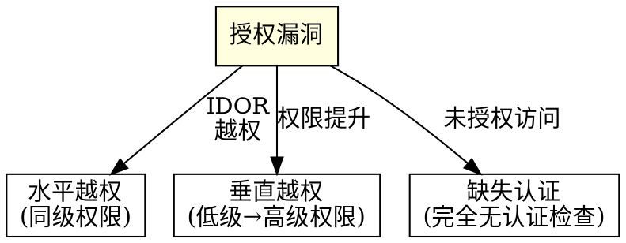

# 授权域

## 概述

授权漏洞允许已认证用户访问他们不应该访问的资源。6,269 个 WooYun 案例证明：开发者构建了身份认证但忽视了授权控制。

**核心原则：** 身份认证回答"你是谁？"授权回答"你能做什么？"大多数应用在第一个问题上表现不错，但在第二个问题上表现糟糕。

## 攻击模式分类



### 水平权限绕过 / IDOR（1,705+230 个案例）

**最容易被忽视的漏洞类型。扫描器无法发现。**

**系统化测试协议：**

```
对于每个返回用户特定数据的 API 端点：

1. 识别资源标识符
   - URL 路径：/api/users/{id}/orders
   - 查询参数：/api/orders?user_id=123
   - POST 请求体：{"user_id": 123, "action": "view"}
   - Cookie/头：X-User-Id: 123

2. 准备两个测试账号（账号 A，账号 B）
   - 以 A 身份登录，记录所有标识符
   - 以 B 身份登录，记录所有标识符

3. 测试每项 CRUD 操作
   - [ ] 创建：A 能否创建 B 拥有的资源？
   - [ ] 读取：A 能否查看 B 的资源？（最常见）
   - [ ] 更新：A 能否修改 B 的资源？
   - [ ] 删除：A 能否删除 B 的资源？

4. 测试标识符操纵
   - [ ] 直接 ID 替换：123 → 124
   - [ ] ID 枚举：遍历 ID 范围
   - [ ] 参数污染：?uid=123&uid=456（服务器取最后一个）
   - [ ] 数组注入：uid[]=123（绕过类型检查）
   - [ ] JSON 嵌套：{"user": {"id": 456}}
   - [ ] 编码 ID：base64(456)、hex(456)
   - [ ] 负数/零 ID：id=0、id=-1
   - [ ] UUID 预测（如果使用了顺序 UUID）
```

**关键参数：** `user_id`, `uid`, `id`, `order_id`, `file_id`, `account_id`, `tenant_id`, `doc_id`, `msg_id`

**WooYun 案例模式：** "北京现代某平台可越权遍历所有用户上传证件（几百万身份证件/行驶证件/发票/驾驶证）" — 顺序文件 ID 且无所有权检查。

### 垂直权限 / 权限提升（255+86 个案例）

**测试协议：**

```
1. 识别权限级别
   - 匿名 → 已注册用户 → 管理员 → 超级管理员
   - 用户角色：买家、卖家、代理人、经理

2. 映射仅限管理员的端点
   - /admin/*, /api/admin/*, /manage/*
   - 用户管理、配置、报告
   - 识别来源：JavaScript 文件、API 文档、网站地图、robots.txt

3. 用低权限会话测试
   - [ ] 用用户令牌访问管理员端点
   - [ ] 添加管理员参数：role=admin, is_admin=true, level=9
   - [ ] 在注册时修改角色：{"role": "admin"}
   - [ ] 完全不带令牌访问管理员 API
   - [ ] 改变 HTTP 方法：GET→POST、POST→PUT
```

### 未授权访问 / 缺失身份认证（2,102+1,891 个案例）

**最基本的漏洞：完全没有身份认证的端点。**

**系统化端点发现：**

| 发现方法 | 目标 |
|---------|------|
| 直接 URL 猜测 | /admin, /console, /debug, /status, /api/docs |
| robots.txt / sitemap.xml | 已披露的"禁止访问"路径 |
| JavaScript 源代码分析 | 前端中硬编码的 API 端点 |
| 错误页面信息 | 暴露内部路径的堆栈跟踪 |
| HTTP 方法探测 | OPTIONS 请求可能暴露端点 |
| 路径遍历变体 | /..;/admin, /%2e%2e/admin |

**测试：**

```
对于每个发现的端点：
1. 不带任何身份认证头/Cookie 访问
2. 如果重定向到登录 → 尝试添加 X-Forwarded-For: 127.0.0.1
3. 如果 403 → 尝试替代 HTTP 方法（GET/POST/PUT/DELETE/PATCH）
4. 如果 403 → 尝试路径规范化：/admin/ vs /admin vs /Admin
5. 如果 403 → 尝试 URL 编码：/%61dmin
6. 记录：哪些端点完全没有身份认证？
```

**WooYun 模式：** 58.2% 的未授权访问发现 = 管理后台完全暴露在互联网上。

### 任意操作 / 任意X（529 个案例，51-86% 高危）

**"权限维度"— 攻击者在任何对象上都不应该执行的操作。**

此类别不同于 IDOR。IDOR 是关于访问"他人的"资源。任意操作是关于执行"你不应该有的操作"——无论资源属于谁。

| 子类别 | 案例数 | 高危占比 | 攻击模式 |
|-------|-------|---------|---------|
| 任意账号访问 | 220 | 86.4% | 不需凭证以任何用户身份登录/操作 |
| 任意修改 | 159 | 63.5% | 修改任何记录（个人资料、配置、内容） |
| 任意用户注册 | 24 | 75.0% | 绕过注册控制（仅邀请、仅管理员） |
| 任意查看 | 45 | 55.6% | 查看超出 IDOR 范围的任何记录（批量导出、管理员视图） |
| 任意删除 | 41 | 51.2% | 删除任何记录无需所有权/权限 |
| 任意操作 | 40 | 72.5% | 执行特权操作（批准、发布、执行） |

**测试协议：**

```
对于每个写入/删除/管理员操作：

1. 识别权限模型
   - 谁应该被允许执行此操作？
   - 检查是在用户级别、角色级别还是对象级别？

2. 测试权限绕过
   - [ ] 以无特权用户身份执行操作
   - [ ] 对非当前用户拥有的对象执行操作
   - [ ] 执行批量操作（通过 API 枚举修改/删除全部）
   - [ ] 以普通用户身份执行仅限管理员的操作（批准、发布）
   - [ ] 自我批准：创建请求 + 批准自己的请求

3. 测试注册控制
   - [ ] 当注册"关闭"或"仅邀请"时注册
   - [ ] 以管理员/提升的角色注册
   - [ ] 绕过电子邮件域名限制
   - [ ] 绕过注册的电话验证
```

## 真实案例

| 案例 | 子域 | 影响 |
|------|------|------|
| 北京现代某平台越权遍历几百万身份证件/行驶证件/发票/驾驶证 | IDOR | 通过顺序文件 ID 暴露数百万身份证件 |
| 花礼网某处平行权限漏洞（影响所有使用用户） | 水平越权 | 所有用户数据可访问 |
| EMS某站点平行权限漏洞涉及大量用户信息 | 水平越权 | 大量用户个人信息暴露 |
| 美国东航网站严重订单信息泄漏及权限绕过 | 垂直越权 | 订单数据 + 权限提升 |
| 挖财网权限绕过登录其他用户账号 | 垂直越权 | 账号接管 |
| 暴风墨镜某站SQL注入/59张表/权限控制数据库 | 垂直越权 | 通过注入实现完整数据库访问 |
| 新浪乐居多处zookeeper未配置权限控制涉及敏感信息 | 缺失认证 | 内部服务暴露 |
| 中国金融认证中心某系统未授权访问（涉及内网信息） | 缺失认证 | 内网访问 |
| 奥鹏教育某处未授权访问可影响大量学生信息 | 缺失认证 | 学生个人信息暴露 |

## 防御模式

### 代码层面
- **默认拒绝：** 将公开端点加入白名单，其他一切都需要身份认证
- **所有权验证：** 在每个查询上验证 `resource.owner_id == current_user.id`
- **ORM 级别过滤：** `Model.where(user_id: current_user.id)` — 永不使用原始 ID
- **不可预测的 ID：** UUID v4，而非顺序整数
- **RBAC/ABAC：** 基于角色或属性的访问控制框架
- **职能分离：** 创建者不能批准自己的请求

### 架构层面
- **API 网关：** 集中式授权执行点
- **零信任：** 验证每个请求，无论其网络来源
- **多租户隔离：** 数据库级别的 tenant_id 过滤
- **URL 模式保护：** 框架级别的路由授权（Spring Security、Django 权限）

### 监控
- **跨用户访问模式：** 用户 A 访问许多其他用户的资源
- **管理员端点访问：** 非管理员 IP 访问 /admin/*
- **ID 枚举检测：** 来自单个会话的顺序 ID 请求
- **权限变更审计：** 所有角色/权限修改已记录
- **批量操作检测：** 单个用户修改/删除异常数量的记录
