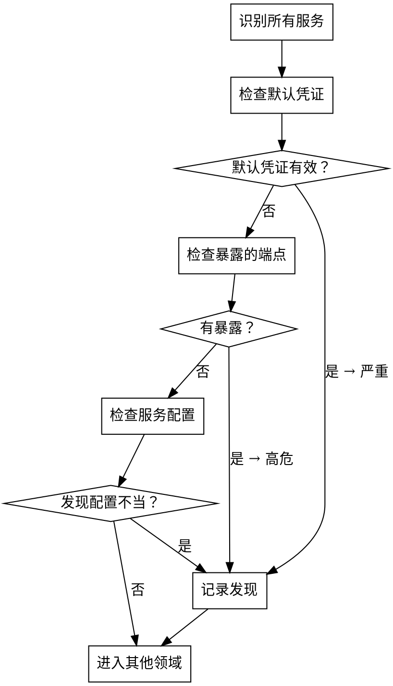

# 配置域

## 概述

配置不当是最容易得手的漏洞。1,796 个 WooYun 案例中 72.6% 为高危，证明：最具破坏力的入侵来自默认配置。

**核心原则：** 每个服务的默认配置都是为了便利而非安全设计的。如果你没有明确加固，就存在漏洞。

## 攻击模式矩阵

### 默认凭证（参考弱口令交叉引用）

**服务特定的默认凭证数据库：**

| 服务 | 默认凭证 | WooYun 出现频率 |
|------|---------|--------------|
| Tomcat Manager | tomcat/tomcat, admin/admin | 极高 |
| JBoss 控制台 | admin/admin, jboss/jboss | 极高 |
| WebLogic | weblogic/weblogic1 | 高 |
| Jenkins | （默认无认证） | 极高 |
| Zabbix | Admin/zabbix | 高 |
| phpMyAdmin | root/（空） | 极高 |
| MongoDB | （默认无认证） | 高 |
| Redis | （默认无认证） | 极高 |
| Elasticsearch | （默认无认证） | 高 |
| Docker Remote API | （默认无认证） | 高 |
| Kubernetes Dashboard | （令牌绕过） | 中等 |
| Grafana | admin/admin | 高 |
| RabbitMQ | guest/guest | 高 |
| ActiveMQ | admin/admin | 高 |
| Nacos | nacos/nacos | 高 |
| Spring Boot Actuator | （默认无认证） | 极高 |
| Hadoop YARN | （默认无认证） | 高 |

### 暴露的管理界面

**系统性发现：**

```
1. Web 管理控制台
   - [ ] /manager/html (Tomcat)
   - [ ] /jmx-console (JBoss)
   - [ ] /console (WebLogic, H2, Rails)
   - [ ] /admin（通用）
   - [ ] /jenkins
   - [ ] /zabbix
   - [ ] /grafana
   - [ ] /solr/admin
   - [ ] /nacos
   - [ ] /actuator (Spring Boot)
   - [ ] /druid (阿里巴巴 Druid)

2. 数据库管理
   - [ ] :3306 (MySQL，无密码)
   - [ ] :6379 (Redis，无认证)
   - [ ] :27017 (MongoDB，无认证)
   - [ ] :9200 (Elasticsearch，无认证)
   - [ ] :5432 (PostgreSQL，信任认证)
   - [ ] /phpmyadmin, /pma, /myadmin

3. 部署/CI 工具
   - [ ] :2375 (Docker Remote API，无 TLS)
   - [ ] :8080 (Jenkins，无认证)
   - [ ] :8443 (Kubernetes Dashboard)
   - [ ] :9000 (Portainer, SonarQube)
   - [ ] :8161 (ActiveMQ)
   - [ ] :15672 (RabbitMQ)

4. 监控/调试
   - [ ] /server-status (Apache)
   - [ ] /nginx_status (Nginx)
   - [ ] /debug/pprof (Go)
   - [ ] /actuator/env (Spring，泄露环境变量)
   - [ ] /actuator/heapdump (Spring，泄露内存)
   - [ ] /trace（暴露请求历史）
```

### 配置不当的服务

**高影响配置不当模式：**

| 配置不当 | 影响 | 测试方法 |
|---------|------|---------|
| 目录列表已启用 | 源代码、配置文件泄露 | 访问无索引文件的目录 |
| CORS 通配符（`*`） | 跨域数据盗取 | 检查 Access-Control-Allow-Origin 头 |
| 允许 PUT/DELETE 方法 | 文件上传、内容修改 | OPTIONS 请求，尝试 PUT 上传文件 |
| 生产环境开启调试模式 | 堆栈跟踪、内部路径 | 触发错误，检查响应详情 |
| 冗长的错误消息 | 数据库结构、代码路径 | 恶意输入，观察错误响应 |
| 开放式重定向 | 钓鱼、令牌盗取 | 修改 redirect_url 参数 |
| 通过 Webhook 进行 SSRF | 内网访问 | 将内网 IP 作为 Webhook URL |
| 无限制文件上传 | Web Shell、远程代码执行 | 上传 .jsp/.php/.aspx 文件 |

### 云配置不当（新兴模式，WooYun 时代后）

**基于现代部署模式的补充：**

```
1. 存储
   - [ ] S3 存储桶公开读/写
   - [ ] Azure Blob 容器匿名访问
   - [ ] GCS 存储桶 allUsers 权限
   - [ ] OSS（阿里云）存储桶 ACL 配置不当

2. 计算
   - [ ] IMDS v1 可访问（无需令牌）
   - [ ] 安全组允许 0.0.0.0/0 访问管理端口
   - [ ] 禁用 SSH 密钥认证，启用密码认证
   - [ ] 用户数据脚本包含凭据

3. IAM
   - [ ] 通配符权限（Action: "*", Resource: "*"）
   - [ ] 跨账户角色信任过于宽松
   - [ ] 服务账户密钥暴露在代码/配置中
   - [ ] 根/管理员账户未启用 MFA
```

## 测试协议



## 真实案例

| 案例 | 子域 | 影响 |
|------|------|------|
| 同程旅游某系统配置不当任意文件上传getshell/root权限 | 配置不当的服务 | 通过文件上传实现根级远程代码执行 |
| ChinaCache某系统JBoss配置不当导致Getshell | 默认凭证/暴露管理界面 | JBoss 管理控制台 → 远程代码执行 |
| 复星保德信某系统配置不当GetShell影响大量保单信息（姓名/身份证/地址） | 配置不当的服务 | 保险单据个人信息泄露 |
| DaoCloud弱口令+docker remote API未授权访问 | 默认凭证 | Docker API → 容器逃逸 |
| 云南农村信用社智慧农信微信管理平台 | 默认凭证 | 银行平台默认凭证 |
| 华夏航空准备网 | 默认凭证 | 航空系统默认凭证 |

## 防御模式

### 代码层面
- 部署前**更改所有默认凭证**
- **禁用不必要的功能：** 调试模式、目录列表、TRACE 方法
- **最小权限原则：** 服务账户仅具有最低必需权限
- **配置即代码：** 版本控制、审查配置更改

### 架构层面
- **网络隔离：** 管理界面仅在内网
- **防火墙规则：** 对管理端口仅允许白名单访问
- **反向代理：** 永远不要直接暴露后端服务
- **密钥管理：** 使用 Vault/KMS 存储凭证，而非配置文件

### 监控
- **默认凭证扫描：** 自动检查已知默认凭证
- **暴露服务检测：** 定期外部扫描开放的管理端口
- **配置漂移：** 对未授权的配置更改发出警报
- **新服务检测：** 对新增监听端口/服务发出警报
