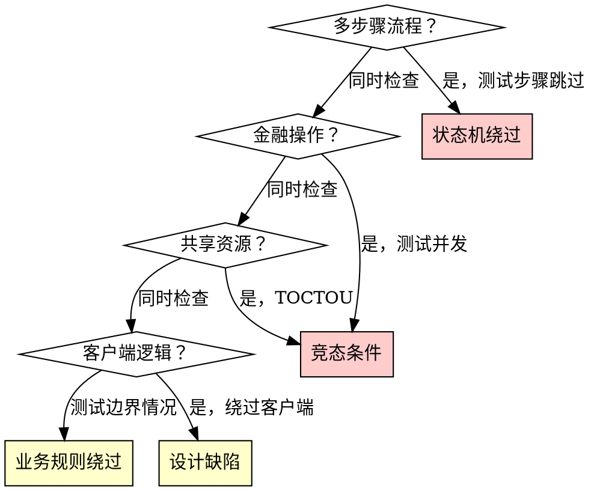

# 业务逻辑领域

## 概述

业务逻辑缺陷最难发现也最难修复。1,679 个 WooYun 案例证明：当状态机错误时，建立在它之上的每个功能都继承这个缺陷。

**核心原则：** 每个多步骤业务流程都是一个状态机。如果能在不满足前置条件的情况下到达某个状态，则状态机被破坏。

## 攻击模式矩阵

### 状态机绕过（1,391 个案例，65.3% 高危）

**基础测试：**

```
对于每个多步骤流程：

1. 映射预期状态序列
   第1步（前置条件：无）→ 第2步（前置条件：第1步完成）→ 第3步 ...

2. 独立测试每个步骤
   - 能否在不完成第2步的情况下到达第3步？
   - 能否在完成第3步后返回第1步？
   - 能否多次重复第2步？
   - 能否在第3步时修改第1步提交的数据？

3. 识别执行机制
   - 客户端 JavaScript 流程？（绕过：直接请求第 N 步端点）
   - 基于会话的状态？（绕过：操纵会话、使用不同会话）
   - 基于令牌的状态？（绕过：预测/重用令牌）
   - 服务器端状态机？（测试：转换逻辑中的边界情况）
```

**常见易受攻击的流程：**

| 业务流程 | 预期步骤 | 绕过攻击 |
|---------|---------|---------|
| 注册 | 邮箱 → 验证 → 个人资料 → 激活 | 跳过验证，直接访问个人资料 |
| 购买 | 购物车 → 地址 → 支付 → 确认 | 跳过支付，直接确认 |
| 密码重置 | 请求 → 验证码 → 新密码 | 跳过码验证，直接设置密码 |
| KYC 验证 | 提交文件 → 审核 → 批准 | 将状态从"已提交"改为"已批准" |
| 退款 | 请求 → 审核 → 批准 → 支付 | 跳过审核，直接触发支付 |

### 竞态条件 / TOCTOU（266 个案例，74.8% 高危）

**业务逻辑中的检查时间到使用时间缺陷：**

```
模式：
  线程A：检查余额(100) → 足够 → 扣款(100) → 余额 = 0
  线程B：检查余额(100) → 足够 → 扣款(100) → 余额 = -100

  结果：从 100 的余额中提取了 200
```

**测试方法：**

```
1. 识别具有检查-行动模式的操作
   - 余额检查 → 提现
   - 库存检查 → 购买
   - 优惠券有效性检查 → 应用优惠券
   - 推荐检查 → 奖励积分

2. 准备竞态条件测试
   - 捕获完整请求
   - 设置 N 个并发相同请求（N = 5-20）
   - 工具：Burp Turbo Intruder、Python 线程、使用 & 后台运行的 curl

3. 执行
   - 同时发送所有 N 个请求
   - 观察：有多少个成功？
   - 预期：仅 1 个应该成功
   - 存在漏洞：多个成功

4. 验证
   - 检查最终状态（余额、库存、优惠券使用次数）
   - 计算：检查-行动是否是原子的？
```

### 业务规则绕过（266+22 个案例）

**利用业务规则中假设的模式：**

| 模式 | 示例 | 测试 |
|------|------|------|
| 负值注入 | 从 A 转账 -100 给 B = 从 B 偷取 | 在所有财务字段中提交负值 |
| 边界条件 | 0.001 × 10000 = 舍入漏洞利用 | 极端小/大值 |
| 类型混淆 | 字符串 "0" vs 整数 0 vs 布尔值 false | 为金额字段提交不同类型 |
| 推荐滥用 | 自推荐：创建账户，推荐自己 | 用自己账户的推荐码注册 |
| 基于时间的绕过 | 在续期和过期检查之间使用服务 | 在支付宽限期内访问功能 |
| 多渠道不一致 | Web 验证，移动 API 不验证 | 通过不同客户端执行相同操作 |
| 部分操作 | 完成原子操作的一半 | 取消转账中途，检查源是否扣款而目标未入账 |

### 设计缺陷作为攻击面（1,391 个案例）

**WooYun "设计缺陷" 类别中的结构模式：**

```
1. 客户端信任
   - 服务器信任客户端提供的：价格、角色、user_id、权限级别
   - 测试：修改影响业务逻辑的每个参数

2. 隐式授权
   - "如果用户到达此页面，他们必定被授权"
   - 测试：直接 URL 访问、不通过 UI 工作流的 API 调用

3. 验证不一致
   - 前端验证，后端不验证
   - 测试：绕过前端（curl、Burp），直接提交到 API

4. 可预测的令牌/ID
   - 顺序订单 ID、基于时间戳的令牌
   - 测试：分析模式，预测下一个值

5. 缺少原子性
   - 多步骤操作未包装在事务中
   - 测试：中断操作，检查部分状态
```

## 决策流程图：哪种逻辑缺陷？



## 真实案例

| 案例 | 子域 | 影响 |
|------|------|------|
| 百合网某APP设计缺陷影响100W+妹子手机号 | 设计缺陷 | 泄露 100 万+ 电话号码 |
| 114票务网某站逻辑漏洞利用支付超时导致上万用户敏感信息泄漏 | 状态机 | 1 万+ 用户（订单/姓名/身份证/列车路线） |
| Zealer Android客户端从脱壳到burp自动加解密插件/SQL注入/逻辑漏洞 | 设计缺陷 | 移动应用完整攻击链 |
| 超级课程表某主营业务逻辑缺陷导致全体用户真实姓名手机和QQ泄露 | 业务规则 | 所有用户的真实姓名 + 电话 + QQ |
| 大特宝官网业务逻辑漏洞可免费甚至低款买保险 | 业务规则 | 免费/打折保险购买 |
| 宏信证券某处设计缺陷 | 设计缺陷 | 证券系统缺陷 |
| 丽子美妆某处严重逻辑漏洞 | 业务规则 | 电商逻辑绕过 |

## 防御模式

### 代码层面
- **服务器端状态机：** 用显式有限状态机强制执行有效转换
- **原子操作：** 具有适当隔离级别的数据库事务
- **乐观锁：** 记录上的版本字段，拒绝过时更新
- **幂等性：** 唯一请求 ID，拒绝重复操作
- **输入验证：** 服务器端、类型安全、范围检查

### 架构层面
- **分布式锁：** Redis/Zookeeper 用于并发访问控制
- **事件溯源：** 所有状态转换的不可变审计跟踪
- **Saga 模式：** 分布式操作的补偿事务
- **断路器：** 防止多服务流中的级联故障

### 监控
- **状态转换异常：** 订单到达无效状态
- **并发操作激增：** 毫秒内的多个相同请求
- **值异常：** 负数、零价格、极端数量
- **跨渠道不一致：** 不同客户端执行相同操作的结果不同
